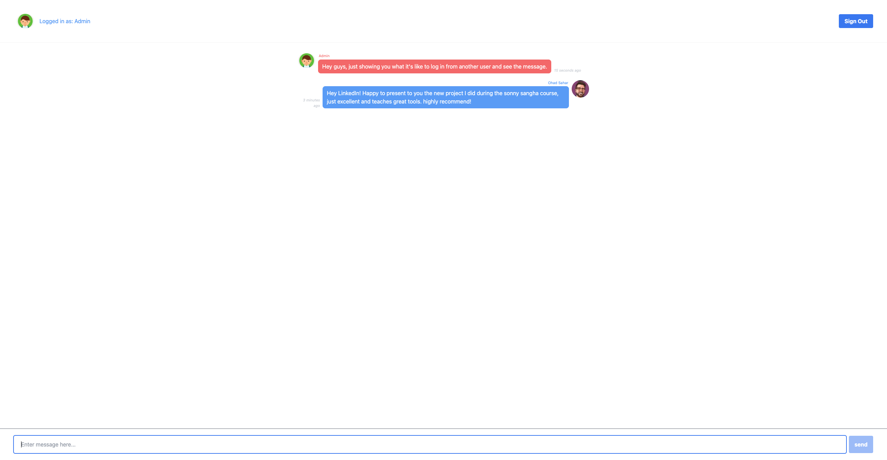
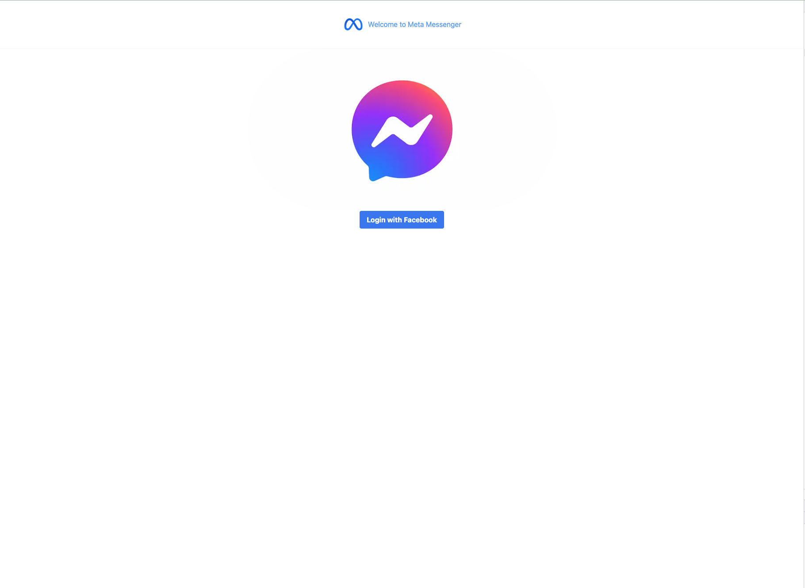
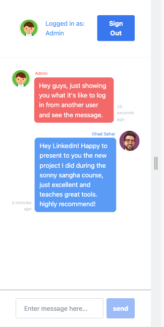
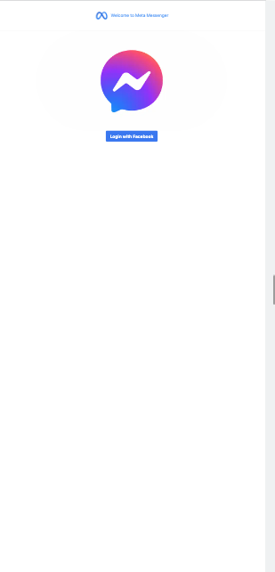

# Meta Messenger Clone

## React + Next.js 13 + Tailwind CSS + SWR + Upstash + Pusher + NextAuth.js

This project was about making a clone of a Meta Messenger room.


In this project you can see the use of a number of innovative technologies that includes:

	1. Upstash for Redis which also allows us to view information in the browser

	2. SWR for proper management of receiving our information and saving it in the cache (for those who don't know, SWR prevents duplication in server calls because it saves it in the cache)

	3. Tailwind CSS for system design

	4. NextAuth for connecting with Facebook

## How to use

```bash
npm i
```
## How to run

```bash
npm run dev
```

# App example

# Desktop


# Mobile



## Many thanks to Sonny Sangha for an excellent course!
